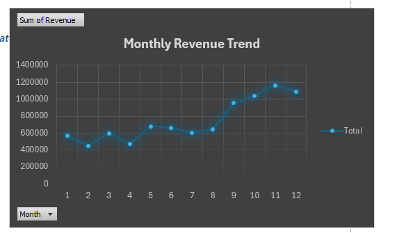
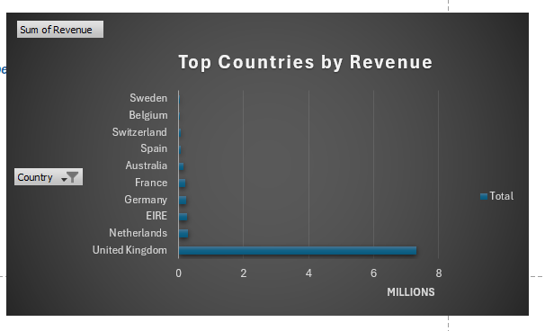
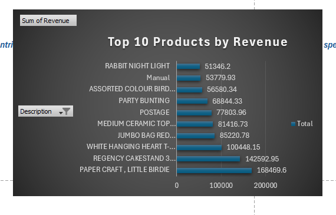
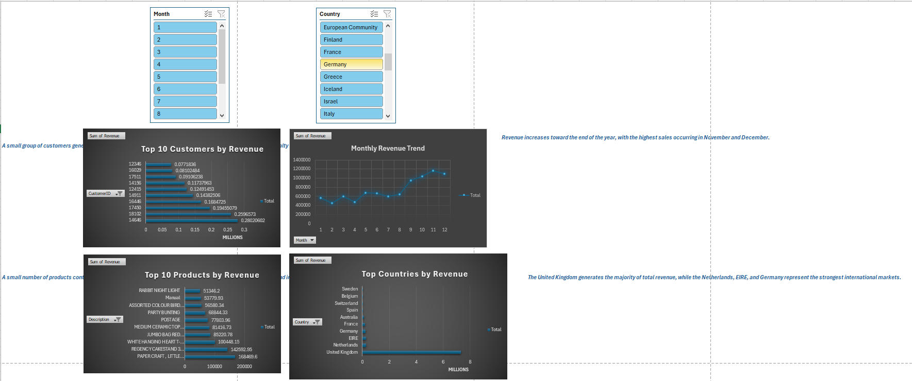

# 📊 E-Commerce Sales Data Analysis

## 🚀 Project Overview
This project analyzes an e-commerce retail dataset containing nearly **400,000 transactions** to uncover actionable business insights.

The goal is to transform raw data into meaningful information that supports **data-driven decision-making** in areas such as sales performance, customer behavior, and product demand.

---

## 🛠️ Tools & Technologies

- Excel (Power Query, Pivot Tables, Dashboards)
- Python (Pandas, Matplotlib, Seaborn)

---

## 🎯 Business Problem

E-commerce businesses generate massive amounts of transactional data, but often struggle to extract insights that drive growth.

Key business questions addressed:

- Which countries generate the most revenue?
- Which products contribute the most to overall sales?
- How does revenue change over time?
- Who are the most valuable customers?
- Is revenue concentrated among a small group of products or customers?

---

## 💡 Business Solution

This project converts raw transactional data into clear insights that help businesses:

- Identify high-performing markets and products  
- Understand customer purchasing behavior  
- Detect sales trends and seasonality  
- Focus on high-value customers  

---

## 📂 Dataset

The dataset includes:

- Invoice number  
- Product details  
- Quantity and pricing  
- Customer ID  
- Country  

After cleaning, the dataset contained **397,924 transactions**.

---

## 📊 Dashboard & Key Insights

### 📈 Monthly Revenue Trend

Revenue shows a clear upward trend toward the end of the year, with peak performance in **November and December**, indicating strong seasonality and potential holiday-driven sales.

---

### 🌍 Top Countries by Revenue

The **United Kingdom dominates total revenue**, while countries like Netherlands, EIRE, and Germany represent strong secondary markets.

---

### 🏆 Top Products by Revenue

A small number of products contribute significantly to total revenue, highlighting a **Pareto distribution (80/20 rule)** in product performance.

---

### 👥 Top Customers by Revenue

A limited group of customers generates a large portion of revenue, emphasizing the importance of **customer retention and loyalty strategies**.

---

## 🧠 Business Recommendations

Based on the analysis:

- Focus marketing efforts on **top-performing countries**
- Prioritize inventory for **high-demand products**
- Leverage seasonal trends for **sales campaigns**
- Develop retention strategies for **high-value customers**

---

## 📁 Project Structure

ecommerce-sales-analysis/  
│── data/  
│── excel/  
│── python/  
│── images/  
│── README.md  

---

## 👨‍💻 Author

**Abdelrahman Elshora**  
- Data Analyst | Backend Developer  
- GitHub: https://github.com/elshora619
